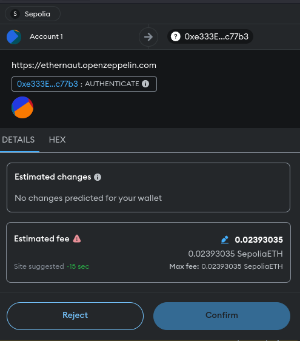
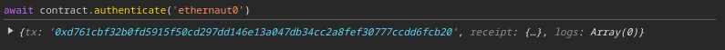
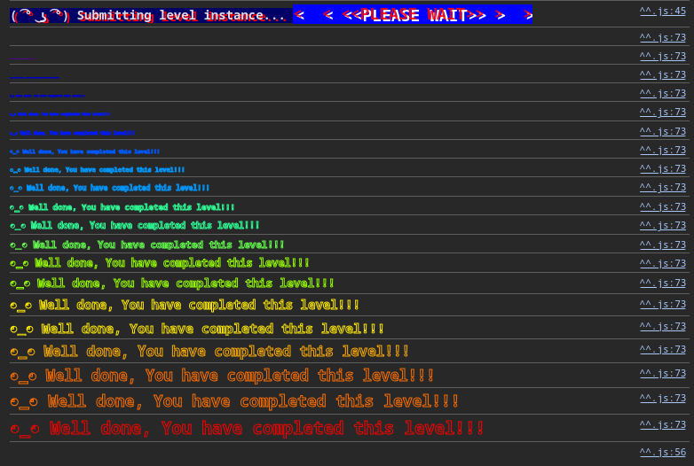

## Challenge
> Interact with the contract to complete the level. Look into the leve's info method `contract.info()` or `await contract.info()` if you're using Chrome v62.

## Walkthrough

I opened the console from Chrome's developer tools and entered a series of instructions followed by `await contract.info()`:
```js
> await contract.info()
'You will find what you need in info1().'
```
```js
> await contract.info1()
'Try info2(), but with "hello" as a parameter.'
```
```js
> await contract.info2("hello")
'The property infoNum holds the number of the next info method to call.'
```

But entered I did `await contract.infoNum()`, it returned me an array. So I printed it into a string, and it returned a number which is `42`. 
```js
> await contract.infoNum()
i {negative: 0, words: Array(2), length: 1, red: null}
> (await contract.infoNum()).toString()
'42'
```

Then I entered `await contract.info42()` and followed through the outputs.
```js
> await contract.info42()
'theMethodName is the name of the next method.'
```
```js
> await contract.theMethodName()
'The method name is method7123949.'
```
```js
> await contract.method7123949()
'If you know the password, submit it to authenticate().'
```

At this point, I could guess that the `contract` object also has a method named `password` and I was right.
```js
> await contract.password()
`ethernaut0`
```

As I got the password now, I tried to authenticate using the method identified in the previous step. It showed me a popup from my Metamask wallet to confirm the transaction.
```js
> await contract.authenticate('ethernaut0')
``` 


After confirming the transaction, I could see the transaction hash in the console output.


Then I clicked the `Submit Instance` button at the bottom of the challenge page. It showed another Metamask popop to confirm the transcation. After that I could see the success message.


It also showed the source code of the challenge.
```solidity
// SPDX-License-Identifier: MIT
pragma solidity ^0.8.0;

contract Instance {
    string public password;
    uint8 public infoNum = 42;
    string public theMethodName = "The method name is method7123949.";
    bool private cleared = false;

    // constructor
    constructor(string memory _password) {
        password = _password;
    }

    function info() public pure returns (string memory) {
        return "You will find what you need in info1().";
    }

    function info1() public pure returns (string memory) {
        return 'Try info2(), but with "hello" as a parameter.';
    }

    function info2(string memory param) public pure returns (string memory) {
        if (keccak256(abi.encodePacked(param)) == keccak256(abi.encodePacked("hello"))) {
            return "The property infoNum holds the number of the next info method to call.";
        }
        return "Wrong parameter.";
    }

    function info42() public pure returns (string memory) {
        return "theMethodName is the name of the next method.";
    }

    function method7123949() public pure returns (string memory) {
        return "If you know the password, submit it to authenticate().";
    }

    function authenticate(string memory passkey) public {
        if (keccak256(abi.encodePacked(passkey)) == keccak256(abi.encodePacked(password))) {
            cleared = true;
        }
    }

    function getCleared() public view returns (bool) {
        return cleared;
    }
}
```