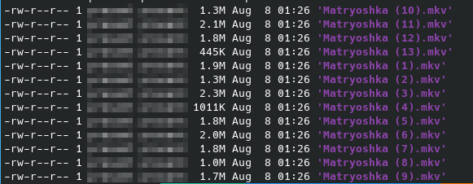
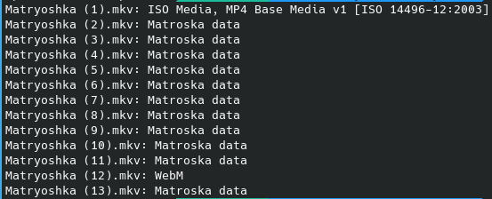
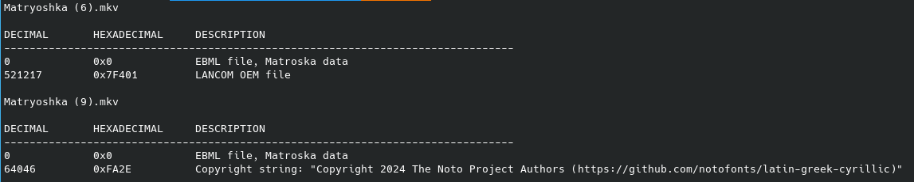
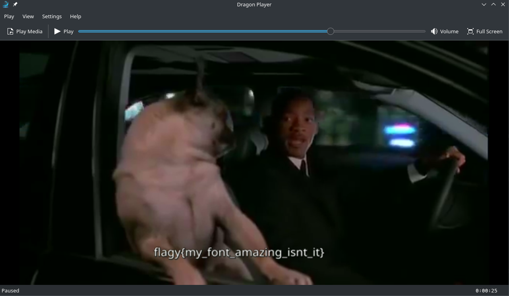

## Challenge
> I am an old game; made of wood and stacked you need to learn some languages to understand me.


Attachments: [Matryoshka.zip](Matryoshka.zip)

## Solution
I donloaded and extracted the file. It was containing some files with `.mkv` extension, which stands for `Matroska Video File`.



Then I check what these files actually contained using the `file` command.
```
for i in {1..13}; do file "Matryoshka ($i).mkv"; done
```
And interestingly, some of them were not `mkv` files.


Then I used `binwalk` to check if these files are hiding some other files in it. I saw that the two files (`Matryoshka (6).mkv` and `Matryoshka (6).mkv`) have two offsets in them. 

```
for i in {1..13}; do file="Matryoshka ($i).mkv"; echo "$file"; binwalk "$file"; done
```


Since they were video files, I tried to open them. The file `Matryoshka (6).mkv` did not have anything interesting, however, the file `Matryoshka (9).mkv` had some subtitles. And yayyyy! the flag was in the subtitles 😋.


