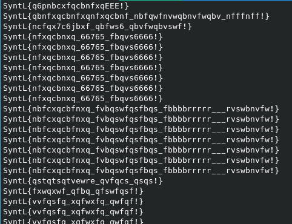
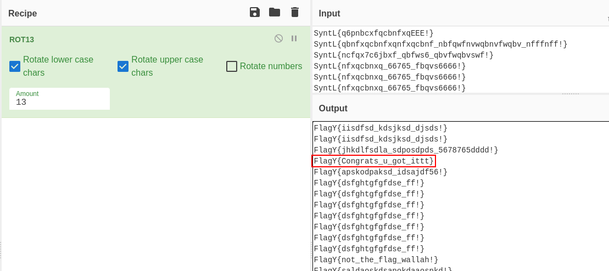

## Challenge
```
Scan it, get it.
```
Attachments: [QRRR!.zip](QRRR!.zip)

## Solution
Let's donwload the file and unzip it file using the command:
```
unzip 'QRRR!.zip'
```

Now we get a GIF image named `QRRR!.gif`. We can see he type of the image  using the command`file 'QRRR!.gif'` command. 


You can see that the QR is changing. So let's try to get each frame of the GIF image and decode them into plain text.

I am using python's `PIL` library to open the image and `pyzbar` library to decode the QR code into plain text.

```py
from PIL import Image
from pyzbar.pyzbar import decode

with Image.open("QRRR!.gif") as gif:
    for i in range(gif.n_frames):
        gif.seek(i)
        print(decode(gif)[0].data.decode())
```

It will print a bunch of lines but we don't see the flag. However, the format of the decoded lines matches the flag format.


So, let's copy these lines and paste it into [cyberchef.io](https://cyberchef.io) and try to decode this. 

Playing with the different encodings, when we try `ROT13`, we can see that the `FlagY` is decoded correctly. And when we scroll, we get the flag. Yayyyy!

