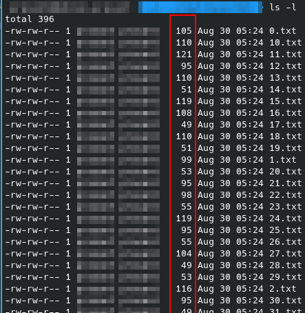
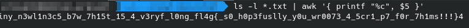
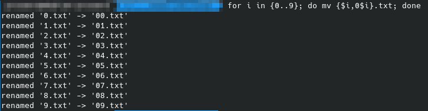
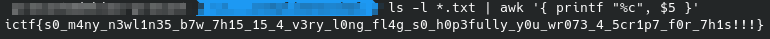

## Challenge
> Why are there so many newlines?

Attachments:
[newlines.zip](newlines.zip)


## Solution
I downloaded and extracted the `newline.zip` file and I could see a bunch of files like `0.txt`, `1.txt`, `2.txt`, etc. I checked the extracted files and all of them had just newlines. 

I did long listing using `ls -l` to check the sizes of those files, and interestingly, they were of different sizes.



The sizes displayed here is on bytes. Since the files are only containing newlines and they are ASCII texts (can be seen by `file` command), the file size is same as the number of newlines in each file. Hence, we can deduce the number of newline characters in each file from the size of the file.

Then I used `awk` to extract only the sizes from this list and tried to check the character representations of those different sizes (or we can say the number of newlines) using the format specifier `%c`.

```
ls -l *.txt | awk '{ printf "%c", $5 }'
```

I used `$5` here because the sizes of the files are at 5th position, separated by an space, on the long list of files. And the output was:



The characters in the flag were misplaced, that's because of the wrong order of the files. The file names are being sorted character-by-character, and to order them correctly, I renamed the files from 0.txt to 9.txt and make them two digit numbers before the extension:
```
for i in {0..9}; do mv {$i,0$i}.txt; done
```


Now I can run the previous command to get the flag.
```
ls -l *.txt | awk '{ printf "%c", $5 }'
```


HOORAY! The flag is here. 😋